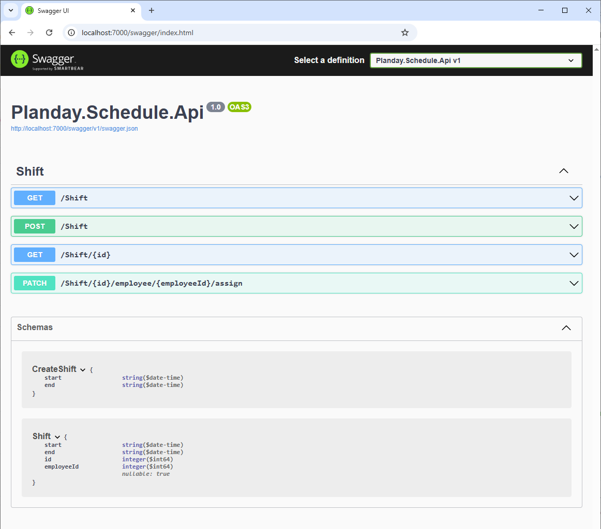
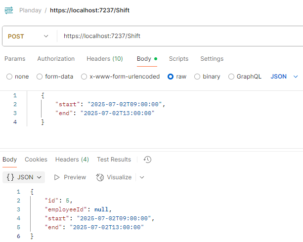
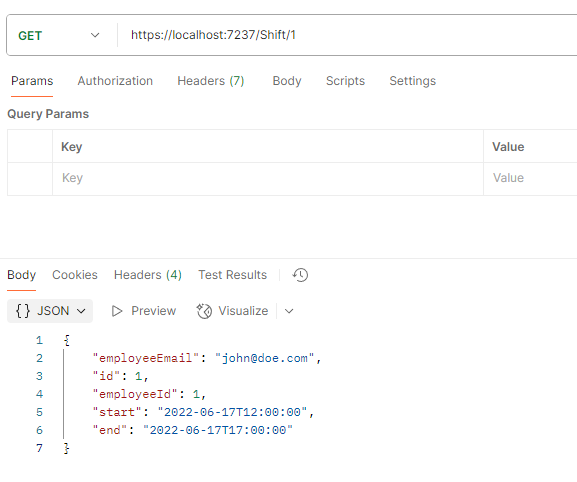

# Code challenge notes

## Build

The solution can be built as so:

```
docker build . -t schedule -f .\Schedule.Api\Dockerfile
```

Run the solution like this:

```
docker run -e PlanDayAuthToken=[the_actual_password] -p 80:8080 schedule
```

... where `[the_actual_password]` is the auth token for the Planday Employee API.

## Notes
* Select methods are covered with unit tests


## Endpoints

The API offers the following endpoints




## Task 1: Query a shift
Endpoint: `GET Shift/{id}`


## Task 2: Create an open shift

Endpoint: `POST /Shift`

Since a shift must be created without an Employee this endpoint takes a `CreateShift` object as input.

Example



## Task 3: Assign a shift to an employee

Endpoint: `PATCH /Shift/{id}/employee/{employeeId}/assign`

If successful only status `200` is returned.

## Task 4: Create an API client to fetch the employee information

Endpoint: `GET Shift/{id}`

Extended `Task 1` with additional logic to call the employee API and also includes the employee email.

When running on your local machine add the key `PlanDayAuthToken` and value `[the_actual_password]` as an environment variable.

Example

